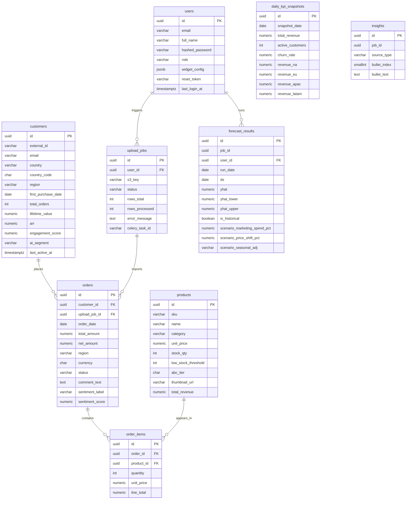

# InsightX Database Schema & ERD

Below is the complete database structure in text/SQL format alongside the Entity-Relationship Diagram (ERD).

## 1. Entity-Relationship Diagram (ERD)

---

## 2. Text Explanation of Tables & Attributes

### `users`
Manages the platform's authentication and user accounts. It stores emails, hashed passwords, roles ([admin](file:///c:/work/InsightX/InsightX-Core/backend/app/routers/auth.py#265-319), `analyst`, `viewer`), and the `widget_config` (JSON) to save each user's drag-and-drop dashboard layout preferences.
**Attributes:**
*   `id` (UUID, Primary Key)
*   `email` (VARCHAR, Unique)
*   `full_name` (VARCHAR)
*   `hashed_password` (VARCHAR)
*   `role` (VARCHAR)
*   `widget_config` (JSONB)
*   `avatar_url` (VARCHAR, Optional)
*   `is_active` (BOOLEAN)
*   `reset_token` (VARCHAR, Optional)
*   `reset_token_expires_at` (TIMESTAMPTZ, Optional)
*   `last_login_at` (TIMESTAMPTZ, Optional)
*   `created_at`, `updated_at`, `deleted_at` (TIMESTAMPTZ)

### `customers`
The core CRM table. It tracks demographic data (country, region), financial metrics (Lifetime Value, Annual Recurring Revenue), and AI-generated segments (e.g., `vip_champion`, `at_risk`). Contains denormalized `lifetime_value` and `total_orders` for fast UI loading without expensive aggregations.
**Attributes:**
*   `id` (UUID, Primary Key)
*   `external_id` (VARCHAR, Unique CSV ID)
*   `email` (VARCHAR, Unique)
*   `full_name` (VARCHAR)
*   `country` (VARCHAR)
*   `country_code` (CHAR)
*   `region` (VARCHAR)
*   `first_purchase_date` (DATE)
*   `total_orders` (INTEGER)
*   `lifetime_value` (NUMERIC)
*   `arr` (NUMERIC)
*   `engagement_score` (NUMERIC)
*   `ai_segment` (VARCHAR)
*   `churn_risk_score` (NUMERIC, Optional)
*   `last_active_at` (TIMESTAMPTZ)
*   `is_active` (BOOLEAN)
*   `created_at`, `updated_at`, `deleted_at` (TIMESTAMPTZ)

### `products`
The main inventory catalogue. It stores `sku`, `name`, `unit_price`, and `stock_qty`. Crucially, it manages low stock alerts via a configurable `low_stock_threshold` and stores the ML-computed `abc_tier` (A, B, or C) used to prioritize inventory.
**Attributes:**
*   `id` (UUID, Primary Key)
*   `sku` (VARCHAR, Unique)
*   `name` (VARCHAR)
*   `category` (VARCHAR)
*   `description` (TEXT, Optional)
*   `unit_price` (NUMERIC)
*   `stock_qty` (INTEGER)
*   `low_stock_threshold` (INTEGER)
*   `abc_tier` (CHAR, Optional)
*   `abc_computed_at` (DATE, Optional)
*   `thumbnail_url` (VARCHAR, Optional)
*   `total_revenue` (NUMERIC)
*   `total_units_sold` (INTEGER)
*   `is_active` (BOOLEAN)
*   `created_at`, `updated_at`, `deleted_at` (TIMESTAMPTZ)

### `orders`
The central Fact table for data analysis. It links a `customer` to an `upload_job` (which CSV imported this order) and records the total financial amounts. It also features fields for `sentiment_label` and `sentiment_score` to store AI analysis of the customer's `comment_text`.
**Attributes:**
*   `id` (UUID, Primary Key)
*   `external_id` (VARCHAR, Unique CSV ID)
*   `customer_id` (UUID, Foreign Key)
*   `upload_job_id` (UUID, Foreign Key)
*   `order_date` (DATE)
*   `total_amount` (NUMERIC)
*   `discount_amount` (NUMERIC)
*   `net_amount` (NUMERIC, Computed Column)
*   `region` (VARCHAR)
*   `currency` (CHAR)
*   `status` (VARCHAR)
*   `comment_text` (TEXT, Optional)
*   `sentiment_label` (VARCHAR, Optional)
*   `sentiment_score` (NUMERIC, Optional)
*   `created_at`, `updated_at` (TIMESTAMPTZ)

### `order_items`
A junction table that connects `orders` to `products`. This handles cases where a single order contains multiple different products. It permanently stores the `unit_price` at the moment of sale, ensuring that if a product's price changes in the future, past transaction records remain totally accurate.
**Attributes:**
*   `id` (UUID, Primary Key)
*   `order_id` (UUID, Foreign Key)
*   `product_id` (UUID, Foreign Key)
*   `quantity` (INTEGER)
*   `unit_price` (NUMERIC)
*   `line_total` (NUMERIC, Computed Column)
*   `created_at` (TIMESTAMPTZ)

### `upload_jobs`
The telemetry table for the CSV ingestion AI Engine. When a user uploads a CSV file, a record is created linking to the `s3_key`. It tracks whether the asynchronous Celery processing is `pending`, `processing`, `completed`, or `failed`, allowing the Next.js UI to render progress bars using `rows_processed` vs `rows_total`.
**Attributes:**
*   `id` (UUID, Primary Key)
*   `user_id` (UUID, Foreign Key)
*   `s3_key` (VARCHAR)
*   `original_filename` (VARCHAR)
*   `status` (VARCHAR)
*   `rows_total` (INTEGER, Optional)
*   `rows_processed` (INTEGER)
*   `rows_failed` (INTEGER)
*   `error_message` (TEXT, Optional)
*   `celery_task_id` (VARCHAR, Optional)
*   `started_at`, `completed_at`, `created_at` (TIMESTAMPTZ)

### `forecast_results`
Dedicated purely to the AI Prophet forecasting charts. It stores the exact parameters ("Scenario Simulation" sliders) and generates the mathematical bounds for the chart (`yhat`, `yhat_lower`, `yhat_upper`). Storing this ensures that previous predictions can be instantly viewed without recalculating.
**Attributes:**
*   `id` (UUID, Primary Key)
*   `job_id` (UUID)
*   `user_id` (UUID, Foreign Key)
*   `run_date` (DATE)
*   `ds` (DATE)
*   `yhat` (NUMERIC)
*   `yhat_lower` (NUMERIC)
*   `yhat_upper` (NUMERIC)
*   `is_historical` (BOOLEAN)
*   `scenario_marketing_spend_pct` (NUMERIC)
*   `scenario_price_shift_pct` (NUMERIC)
*   `scenario_seasonal_adj` (VARCHAR)
*   `created_at` (TIMESTAMPTZ)

### `daily_kpi_snapshots`
The primary source for the fast Dashboard performance metrics. A Celery cron task generates aggregates of `total_revenue`, `active_customers`, and `churn_rate` once a day. This ensures the dashboard delta indicators (like +12% Revenue) can be rendered in constant time without needing to scan millions of rows on every page load.
**Attributes:**
*   `id` (UUID, Primary Key)
*   `snapshot_date` (DATE, Unique)
*   `total_revenue` (NUMERIC)
*   `active_customers` (INTEGER)
*   `new_customers` (INTEGER)
*   `total_orders` (INTEGER)
*   `churn_rate` (NUMERIC)
*   `avg_order_value` (NUMERIC)
*   `revenue_na`, `revenue_eu`, `revenue_apac`, `revenue_latam` (NUMERIC)
*   `created_at` (TIMESTAMPTZ)

### `insights`
Stores synthesized LLM outputs (e.g., from Groq LLaMA 3). When complex numerical analysis finishes, it generates three English bullet points (`bullet_index` 1, 2, 3) summarizing the findings. This table persists those exact NLP phrases.
**Attributes:**
*   `id` (UUID, Primary Key)
*   `job_id` (UUID)
*   `source_type` (VARCHAR)
*   `bullet_index` (SMALLINT)
*   `bullet_text` (TEXT)
*   `created_at` (TIMESTAMPTZ)
