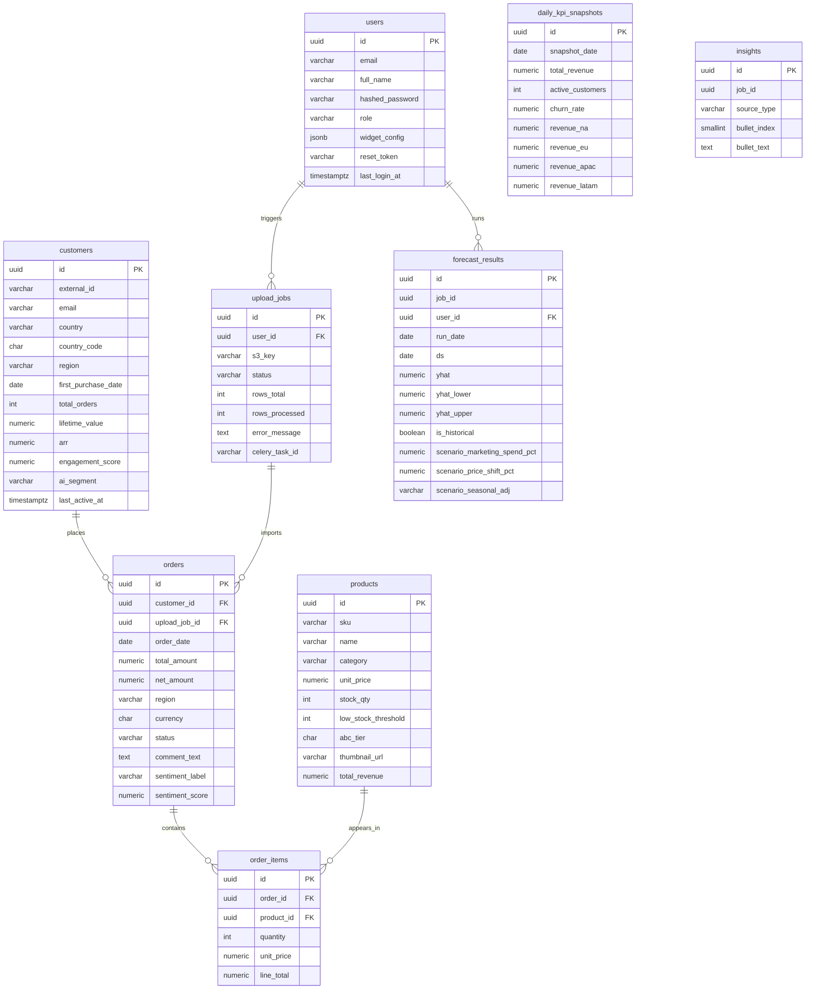

# InsightX — Comprehensive Database Schema Review & Enhancement

## Executive Summary

After analyzing all 9 UI stitch screens, 4 Celery worker tasks, the Docker/Celery configuration, and all business logic workflows, **the database needs 9 tables** (vs. the 6 initially proposed). Three additional tables are required:

| Added Table | Reason |
|---|---|
| `upload_jobs` | The UI has a full CSV upload pipeline with async job polling — this needs its own tracking table |
| `daily_kpi_snapshots` | Dashboard KPIs show period-over-period deltas ("+12%") which require pre-aggregated historical snapshots |
| `order_items` | A normalized orders model is needed — one order can contain multiple products |

---

## Gap Analysis: What Was Missing

| # | Gap Found | UI / Logic That Exposes It |
|---|---|---|
| G1 | No `upload_jobs` table | CSV upload button → async Celery preprocess → job status polling endpoint |
| G2 | No `order_items` table | Product inventory tracks `stock_qty` which decreases per order line; one order → many products |
| G3 | No `daily_kpi_snapshots` table | Dashboard shows "+12% vs last month" delta — cannot compute without prior period stored |
| G4 | No `engagement_score` on customer | Segmentation chart: "Avg Engagement 84%" + bubble size = engagement |
| G5 | No `last_active_at` on customer | At-Risk definition: "Last active > 90 days ago" (segmentation screen) |
| G6 | No `widget_config` on user | Analytics Edit Mode: "Save Layout" button persists per-user drag-and-drop widget arrangement |
| G7 | No `abc_tier` computation fields on product | Product table shows ABC tier badge — needs to be stored/computed, not derived live |
| G8 | No `scenario_params` on forecast result | Forecasting sliders (marketing spend %, price shift %, seasonal) must be stored with each run |
| G9 | No `region` on orders | Revenue by Region chart requires region per transaction, not just per customer |
| G10 | No `currency` field | International customers (US, UK, DE, JP, FR, CA seen in UI) require currency tracking |
| G11 | No password reset token support | Login page has "Forgot password?" link |
| G12 | No soft-delete pattern | All tables need `deleted_at` to support restore and audit trails |

---

## Complete Schema — 9 Tables

---

### Table 1: `users`

**Justifies:** Login screen (email + password fields), Sign-up screen (full_name + role), Analytics Edit Mode (widget layout saved per user), sidebar shows "Alex Morgan / Admin".

```sql
CREATE TABLE users (
    id              UUID PRIMARY KEY DEFAULT gen_random_uuid(),
    email           VARCHAR(255) NOT NULL UNIQUE,
    full_name       VARCHAR(255) NOT NULL,
    hashed_password VARCHAR(255) NOT NULL,
    role            VARCHAR(50)  NOT NULL DEFAULT 'analyst',
                    -- Enum: 'admin' | 'analyst' | 'viewer'
    widget_config   JSONB        NOT NULL DEFAULT '{}',
                    -- Stores the drag-and-drop layout from Analytics Edit Mode
                    -- Example: {"layout": [{"i":"revenue_chart","x":0,"y":0,"w":8,"h":2}]}
    avatar_url      VARCHAR(500),
                    -- Profile picture shown in sidebar and header
    is_active       BOOLEAN      NOT NULL DEFAULT TRUE,
    reset_token     VARCHAR(255),
                    -- Hashed token for "Forgot password?" flow
    reset_token_expires_at TIMESTAMPTZ,
    last_login_at   TIMESTAMPTZ,
    created_at      TIMESTAMPTZ  NOT NULL DEFAULT NOW(),
    updated_at      TIMESTAMPTZ  NOT NULL DEFAULT NOW(),
    deleted_at      TIMESTAMPTZ            -- Soft delete
);

-- Indexes
CREATE INDEX idx_users_email     ON users(email);
CREATE INDEX idx_users_role      ON users(role);
CREATE INDEX idx_users_is_active ON users(is_active) WHERE is_active = TRUE;
```

**Design Decisions:**
- `UUID` primary key — avoids sequential ID enumeration attacks on auth endpoints
- `widget_config JSONB` — single-column approach for the drag-and-drop layout state; avoids creating a many-row layout table for a simple JSON blob
- `role` as VARCHAR with CHECK constraint instead of enum — easier to extend without a migration
- `reset_token` — supports the "Forgot password?" link shown on the login page
- `deleted_at` soft delete — user accounts should be deactivatable, not permanently deleted

---

### Table 2: `customers`

**Justifies:** Customer Profiles table (ID, email, country, first_purchase_date, total_orders, LTV, AI segment), Customer Segmentation (engagement_score, last_active_at, segment for bubble chart), Dashboard Active Customers KPI.

```sql
CREATE TABLE customers (
    id                  UUID         PRIMARY KEY DEFAULT gen_random_uuid(),
    external_id         VARCHAR(50)  UNIQUE,
                        -- The "CUS-001" style ID shown in the UI, from source CSV
    email               VARCHAR(255) NOT NULL UNIQUE,
    full_name           VARCHAR(255),
    country             VARCHAR(100),
                        -- "United States", "Canada", etc. shown in table
    country_code        CHAR(2),
                        -- ISO 3166 code, e.g. "US", "CA" — for flag emoji rendering
    region              VARCHAR(50),
                        -- Enum: 'NA' | 'EU' | 'APAC' | 'LATAM' — for Revenue by Region chart
    first_purchase_date DATE,
                        -- "Oct 24, 2023" column in Customer Profiles table
    total_orders        INTEGER      NOT NULL DEFAULT 0,
                        -- Denormalized count for fast table rendering; recalculated on each preprocess
    lifetime_value      NUMERIC(12,2) NOT NULL DEFAULT 0.00,
                        -- "$12,450.00" column — sum of all order revenues
    arr                 NUMERIC(12,2) NOT NULL DEFAULT 0.00,
                        -- Annual Recurring Revenue — shown in Segmentation screen
    engagement_score    NUMERIC(5,2) NOT NULL DEFAULT 0.00,
                        -- 0.00–100.00; used for bubble chart Y-axis and "Avg Engagement 84%"
    ai_segment          VARCHAR(50),
                        -- Enum: 'vip_champion' | 'loyalist' | 'at_risk' | 'new_potential' | 'undetermined'
                        -- Displayed as badge: "VIP Champion", "At-Risk", etc.
    last_active_at      TIMESTAMPTZ,
                        -- Last order date; At-Risk rule: last_active_at < NOW() - INTERVAL '90 days'
    churn_risk_score    NUMERIC(4,2),
                        -- 0.00–1.00; computed by future ML model, displayed in segmentation
    is_active           BOOLEAN      NOT NULL DEFAULT TRUE,
    created_at          TIMESTAMPTZ  NOT NULL DEFAULT NOW(),
    updated_at          TIMESTAMPTZ  NOT NULL DEFAULT NOW(),
    deleted_at          TIMESTAMPTZ
);

-- Indexes
CREATE INDEX idx_customers_email         ON customers(email);
CREATE INDEX idx_customers_country_code  ON customers(country_code);
CREATE INDEX idx_customers_region        ON customers(region);
CREATE INDEX idx_customers_ai_segment    ON customers(ai_segment);
CREATE INDEX idx_customers_ltv           ON customers(lifetime_value DESC);
CREATE INDEX idx_customers_last_active   ON customers(last_active_at);
CREATE INDEX idx_customers_external_id   ON customers(external_id);

-- Constraint
ALTER TABLE customers ADD CONSTRAINT chk_customers_engagement
    CHECK (engagement_score BETWEEN 0 AND 100);
ALTER TABLE customers ADD CONSTRAINT chk_customers_churn_risk
    CHECK (churn_risk_score BETWEEN 0 AND 1 OR churn_risk_score IS NULL);
```

**Design Decisions:**
- `external_id` stores the "CUS-001" format from imported CSVs (separate from internal UUID)
- `country` + `country_code` both stored — `country` for display text, `country_code` for programmatic logic and flag emoji
- `region` denormalized on customer for fast Revenue by Region aggregation (avoids expensive JOIN + CASE every query)
- `total_orders` + `lifetime_value` are intentionally denormalized — the Customer Profiles table sorts by these; recomputing from orders on every page load is too expensive at scale
- `engagement_score` computed during preprocessing from recency, frequency, and last login signals
- `last_active_at` is what drives the At-Risk segment rule in the Segmentation screen

---

### Table 3: `products`

**Justifies:** Product Inventory table (SKU, name, category, stock, unit_price, ABC tier, thumbnail), Inventory stats cards (Total SKUs, Inventory Value, Low Stock count, Category count).

```sql
CREATE TABLE products (
    id              UUID          PRIMARY KEY DEFAULT gen_random_uuid(),
    sku             VARCHAR(20)   NOT NULL UNIQUE,
                    -- "SK-9021" format shown in Product table
    name            VARCHAR(500)  NOT NULL,
                    -- "Wireless Noise-Cancelling Headphones"
    category        VARCHAR(100)  NOT NULL,
                    -- "Electronics", "Furniture", "Accessories" — used for filter chips
    description     TEXT,
    unit_price      NUMERIC(10,2) NOT NULL,
                    -- "$299.00" column
    stock_qty       INTEGER       NOT NULL DEFAULT 0,
                    -- Current stock level; dot indicator: green(>20), orange(10-20), red(<10)
    low_stock_threshold INTEGER   NOT NULL DEFAULT 10,
                    -- Configurable per-product; determines "Low Stock" alert
    abc_tier        CHAR(1),
                    -- 'A', 'B', or 'C'; computed during preprocess based on revenue contribution
                    -- A = top 20% revenue, B = next 30%, C = remaining 50%
    abc_computed_at DATE,
                    -- Date the ABC tier was last recalculated
    thumbnail_url   VARCHAR(500),
                    -- Product image shown in table row
    total_revenue   NUMERIC(12,2) NOT NULL DEFAULT 0.00,
                    -- Denormalized cumulative revenue for this product; used for ABC computation
    total_units_sold INTEGER      NOT NULL DEFAULT 0,
                    -- Denormalized total units sold; used for reporting
    is_active       BOOLEAN       NOT NULL DEFAULT TRUE,
    created_at      TIMESTAMPTZ   NOT NULL DEFAULT NOW(),
    updated_at      TIMESTAMPTZ   NOT NULL DEFAULT NOW(),
    deleted_at      TIMESTAMPTZ
);

-- Indexes
CREATE INDEX idx_products_sku        ON products(sku);
CREATE INDEX idx_products_category   ON products(category);
CREATE INDEX idx_products_abc_tier   ON products(abc_tier);
CREATE INDEX idx_products_stock      ON products(stock_qty);
CREATE INDEX idx_products_revenue    ON products(total_revenue DESC);

-- Constraint
ALTER TABLE products ADD CONSTRAINT chk_products_abc_tier
    CHECK (abc_tier IN ('A', 'B', 'C') OR abc_tier IS NULL);
ALTER TABLE products ADD CONSTRAINT chk_products_stock_qty
    CHECK (stock_qty >= 0);
ALTER TABLE products ADD CONSTRAINT chk_products_price
    CHECK (unit_price >= 0);
```

**Design Decisions:**
- `low_stock_threshold` per-product (not system-wide) — different products have different reorder points
- `abc_tier` + `abc_computed_at` stored on product — must be persisted, not computed on-the-fly (expensive over 450 SKUs)
- `total_revenue` + `total_units_sold` denormalized — required for the "Inventory Value" stats card and ABC computation without a full orders JOIN
- Red blinking dot in UI when stock < threshold — `low_stock_threshold` column enables this logic

---

### Table 4: `orders`

**Justifies:** Sales Trend chart (daily revenue), KPI cards (Total Revenue), CSV upload pipeline (the primary ingested entity), Revenue by Region bar chart. This is the central fact table.

```sql
CREATE TABLE orders (
    id              UUID          PRIMARY KEY DEFAULT gen_random_uuid(),
    external_id     VARCHAR(50)   UNIQUE,
                    -- Original order ID from imported CSV
    customer_id     UUID          NOT NULL REFERENCES customers(id) ON DELETE RESTRICT,
    upload_job_id   UUID          REFERENCES upload_jobs(id),
                    -- Tracks which CSV import created this order
    order_date      DATE          NOT NULL,
                    -- The transaction date — X-axis for Sales Trend chart
    total_amount    NUMERIC(12,2) NOT NULL,
                    -- Full order value after line items summed
    discount_amount NUMERIC(10,2) NOT NULL DEFAULT 0.00,
    net_amount      NUMERIC(12,2) GENERATED ALWAYS AS (total_amount - discount_amount) STORED,
                    -- Actual revenue; used for all KPI aggregations
    region          VARCHAR(50)   NOT NULL,
                    -- 'NA' | 'EU' | 'APAC' | 'LATAM' — for Revenue by Region chart
                    -- Copied from customer.region at order time (denormalized for historical accuracy)
    currency        CHAR(3)       NOT NULL DEFAULT 'USD',
                    -- ISO 4217, e.g. 'USD', 'EUR', 'GBP', 'JPY' — international customers
    status          VARCHAR(30)   NOT NULL DEFAULT 'completed',
                    -- 'completed' | 'refunded' | 'pending' | 'cancelled'
    comment_text    TEXT,
                    -- Raw customer comment — fed to BERT sentiment task (worker/tasks/sentiment.py)
    sentiment_label VARCHAR(20),
                    -- 'POSITIVE' | 'NEGATIVE' | 'NEUTRAL'; populated by run_sentiment task
    sentiment_score NUMERIC(5,4),
                    -- Confidence score from BERT model, 0.0000–1.0000
    created_at      TIMESTAMPTZ   NOT NULL DEFAULT NOW(),
    updated_at      TIMESTAMPTZ   NOT NULL DEFAULT NOW()
);

-- Indexes (critical for dashboard query performance)
CREATE INDEX idx_orders_customer_id  ON orders(customer_id);
CREATE INDEX idx_orders_order_date   ON orders(order_date DESC);
CREATE INDEX idx_orders_region       ON orders(region);
CREATE INDEX idx_orders_status       ON orders(status);
CREATE INDEX idx_orders_upload_job   ON orders(upload_job_id);

-- Composite index for Sales Trend query (most frequent dashboard query)
CREATE INDEX idx_orders_date_region  ON orders(order_date, region, net_amount);

-- Constraint
ALTER TABLE orders ADD CONSTRAINT chk_orders_status
    CHECK (status IN ('completed', 'refunded', 'pending', 'cancelled'));
ALTER TABLE orders ADD CONSTRAINT chk_orders_sentiment
    CHECK (sentiment_label IN ('POSITIVE', 'NEGATIVE', 'NEUTRAL') OR sentiment_label IS NULL);
```

**Design Decisions:**
- `net_amount` as a computed/generated column — prevents inconsistency between `total_amount - discount` and stored values
- `region` denormalized onto order — if a customer moves region, historical data is preserved correctly
- `comment_text` + `sentiment_label` + `sentiment_score` on the orders table — this is what [worker/tasks/sentiment.py](file:///c:/work/InsightX/InsightX-Core/worker/tasks/sentiment.py) processes; sentiment is order-level, not customer-level
- `upload_job_id` FK — enables data lineage: "which CSV batch did this order come from?"
- `status` allows refund tracking → refunded orders excluded from revenue KPIs

---

### Table 5: `order_items`

**Justifies:** Product `stock_qty` must decrease per line item sold. One order can include multiple SKUs (e.g., "42 total orders for 8 different products"). Required for ABC tier computation (revenue contribution per product).

```sql
CREATE TABLE order_items (
    id          UUID          PRIMARY KEY DEFAULT gen_random_uuid(),
    order_id    UUID          NOT NULL REFERENCES orders(id) ON DELETE CASCADE,
    product_id  UUID          NOT NULL REFERENCES products(id) ON DELETE RESTRICT,
    quantity    INTEGER       NOT NULL,
    unit_price  NUMERIC(10,2) NOT NULL,
                -- Price at time of purchase (not current product.unit_price)
    line_total  NUMERIC(12,2) GENERATED ALWAYS AS (quantity * unit_price) STORED,
    created_at  TIMESTAMPTZ   NOT NULL DEFAULT NOW()
);

-- Indexes
CREATE INDEX idx_order_items_order_id   ON order_items(order_id);
CREATE INDEX idx_order_items_product_id ON order_items(product_id);

-- Constraint
ALTER TABLE order_items ADD CONSTRAINT chk_order_items_qty
    CHECK (quantity > 0);
ALTER TABLE order_items ADD CONSTRAINT chk_order_items_price
    CHECK (unit_price >= 0);
```

**Design Decisions:**
- `unit_price` captured at order time — product prices change; historical integrity requires snapshotting the price
- `line_total` generated column — avoids inconsistent stored values
- `ON DELETE CASCADE` — if an order is deleted (bad import), its items go with it
- `ON DELETE RESTRICT` on product — cannot delete a product that has associated sale records

---

### Table 6: `upload_jobs`

**Justifies:** "Import" button on Customer Profiles page, CSV upload workflow in the preprocess worker task, `GET /upload/status/{job_id}` endpoint, Celery [preprocess](file:///c:/work/InsightX/InsightX-Core/worker/tasks/preprocess.py#6-11) task's `job_id` parameter.

> [!IMPORTANT]
> This table was completely missing from the initial proposal. Without it, there is no way to track upload status, errors, or data lineage.

```sql
CREATE TABLE upload_jobs (
    id              UUID          PRIMARY KEY DEFAULT gen_random_uuid(),
    user_id         UUID          NOT NULL REFERENCES users(id),
                    -- Who triggered the upload
    s3_key          VARCHAR(500)  NOT NULL,
                    -- S3 object key for the uploaded CSV file
    original_filename VARCHAR(255),
                    -- The filename the user uploaded (for display)
    status          VARCHAR(30)   NOT NULL DEFAULT 'pending',
                    -- 'pending' | 'processing' | 'completed' | 'failed'
    rows_total      INTEGER,
                    -- Total rows in the CSV (detected during preprocessing)
    rows_processed  INTEGER       NOT NULL DEFAULT 0,
                    -- Rows successfully inserted
    rows_failed     INTEGER       NOT NULL DEFAULT 0,
                    -- Rows that failed validation
    error_message   TEXT,
                    -- Human-readable error if status = 'failed'
    celery_task_id  VARCHAR(255),
                    -- Celery task ID for status polling via Celery result backend
    started_at      TIMESTAMPTZ,
    completed_at    TIMESTAMPTZ,
    created_at      TIMESTAMPTZ   NOT NULL DEFAULT NOW()
);

-- Indexes
CREATE INDEX idx_upload_jobs_user_id ON upload_jobs(user_id);
CREATE INDEX idx_upload_jobs_status  ON upload_jobs(status);
CREATE INDEX idx_upload_jobs_created ON upload_jobs(created_at DESC);

-- Constraint
ALTER TABLE upload_jobs ADD CONSTRAINT chk_upload_jobs_status
    CHECK (status IN ('pending', 'processing', 'completed', 'failed'));
```

**Design Decisions:**
- Separate table (not in orders) — one upload job creates many orders; 1:many relationship
- `celery_task_id` stored alongside internal `id` — frontend can poll either the Celery backend or the DB row
- `rows_total` / `rows_processed` / `rows_failed` — enables a progress bar UI element
- `s3_key` persisted — allows re-processing or rollback of a bad import

---

### Table 7: `forecast_results`

**Justifies:** Forecasting Module chart (historical + dashed prediction + confidence band), Scenario Simulation Panel (marketing spend %, price shift %, seasonal adjustment sliders), "Save Forecast" button, "Export" button.

```sql
CREATE TABLE forecast_results (
    id              UUID          PRIMARY KEY DEFAULT gen_random_uuid(),
    job_id          UUID          NOT NULL,
                    -- Celery task ID or internal run ID
    user_id         UUID          REFERENCES users(id),
                    -- Who triggered the forecast run
    run_date        DATE          NOT NULL,
                    -- The date the forecast was computed
    ds              DATE          NOT NULL,
                    -- Prophet date column — each row is one daily forecast point
    yhat            NUMERIC(14,2) NOT NULL,
                    -- Forecast center value — the dashed purple line on the chart
    yhat_lower      NUMERIC(14,2) NOT NULL,
                    -- Lower confidence bound — bottom of shaded confidence area
    yhat_upper      NUMERIC(14,2) NOT NULL,
                    -- Upper confidence bound — top of shaded confidence area
    is_historical   BOOLEAN       NOT NULL DEFAULT FALSE,
                    -- TRUE = actual historical point (solid blue line), FALSE = prediction
    -- Scenario parameters (from the Scenario Simulation Panel sliders)
    scenario_marketing_spend_pct  NUMERIC(5,2) NOT NULL DEFAULT 0.00,
                    -- "Marketing Spend Increase" slider, e.g. 15.00 means +15%
    scenario_price_shift_pct      NUMERIC(5,2) NOT NULL DEFAULT 0.00,
                    -- "Expected Price Shift" slider, e.g. 5.00 means +5%
    scenario_seasonal_adj         VARCHAR(10)  NOT NULL DEFAULT 'medium',
                    -- "Seasonal Adjustment" toggle: 'low' | 'medium' | 'high'
    created_at      TIMESTAMPTZ   NOT NULL DEFAULT NOW(),
    
    UNIQUE(job_id, ds)  -- One row per date per forecast run
);

-- Indexes
CREATE INDEX idx_forecast_run_date ON forecast_results(run_date DESC);
CREATE INDEX idx_forecast_job_id   ON forecast_results(job_id);
CREATE INDEX idx_forecast_ds       ON forecast_results(ds);
CREATE INDEX idx_forecast_user_id  ON forecast_results(user_id);

-- Constraint
ALTER TABLE forecast_results ADD CONSTRAINT chk_forecast_seasonal
    CHECK (scenario_seasonal_adj IN ('low', 'medium', 'high'));
ALTER TABLE forecast_results ADD CONSTRAINT chk_forecast_yhat_range
    CHECK (yhat_lower <= yhat AND yhat <= yhat_upper);
```

**Design Decisions:**
- `is_historical` flag on same table — simplifies the chart query (single SELECT returns all lines)
- Scenario params stored per-job on each row (denormalized) — makes it trivial to reconstruct any scenario
- `UNIQUE(job_id, ds)` — prevents duplicate dates within a single forecast run
- `CHECK (yhat_lower <= yhat <= yhat_upper)` — enforces mathematical correctness of the confidence band

---

### Table 8: `daily_kpi_snapshots`

**Justifies:** Dashboard KPI cards show performance deltas vs. prior period: "+12% Total Revenue", "+5% Active Customers", "-0.5% Churn Rate". Without storing past snapshots, period-over-period comparisons require scanning all historical orders on every page load.

> [!IMPORTANT]
> This table was completely missing from both the initial proposal and obvious from the "vs previous month" labels in the dashboard UI.

```sql
CREATE TABLE daily_kpi_snapshots (
    id                  UUID          PRIMARY KEY DEFAULT gen_random_uuid(),
    snapshot_date       DATE          NOT NULL UNIQUE,
                        -- One row per calendar day
    total_revenue       NUMERIC(14,2) NOT NULL DEFAULT 0.00,
    active_customers    INTEGER       NOT NULL DEFAULT 0,
    new_customers       INTEGER       NOT NULL DEFAULT 0,
    total_orders        INTEGER       NOT NULL DEFAULT 0,
    churn_rate          NUMERIC(6,4)  NOT NULL DEFAULT 0.0000,
                        -- Percentage as decimal, e.g. 0.0240 = 2.4%
    avg_order_value     NUMERIC(10,2) NOT NULL DEFAULT 0.00,
    revenue_na          NUMERIC(14,2) NOT NULL DEFAULT 0.00,
                        -- Revenue from North America region
    revenue_eu          NUMERIC(14,2) NOT NULL DEFAULT 0.00,
    revenue_apac        NUMERIC(14,2) NOT NULL DEFAULT 0.00,
    revenue_latam       NUMERIC(14,2) NOT NULL DEFAULT 0.00,
    created_at          TIMESTAMPTZ   NOT NULL DEFAULT NOW()
);

-- Indexes
CREATE INDEX idx_kpi_snapshot_date ON daily_kpi_snapshots(snapshot_date DESC);
```

**Design Decisions:**
- One row per day — allows computing 30-day vs. 30-day, 7-day trailing, or month-over-month comparisons in O(1)
- Regional revenue columns pre-split — avoids re-aggregating over orders for each region every dashboard load
- Populated by a nightly Celery beat task (or triggered at end of each upload job)
- `churn_rate` as 4-decimal NUMERIC — e.g. 0.0240 displayed as "2.4%" in the UI

---

### Table 9: [insights](file:///c:/work/InsightX/InsightX-Core/worker/tasks/insights.py#6-11)

**Justifies:** [worker/tasks/insights.py](file:///c:/work/InsightX/InsightX-Core/worker/tasks/insights.py) — "Send synthesised summary to Groq LLaMA 3 and store 3 bullet insights." These need to persist per analysis run and be retrievable by the frontend.

```sql
CREATE TABLE insights (
    id              UUID          PRIMARY KEY DEFAULT gen_random_uuid(),
    job_id          UUID          NOT NULL,
                    -- Links to the preprocess or forecast run that triggered this
    source_type     VARCHAR(30)   NOT NULL,
                    -- 'preprocess' | 'forecast' | 'sentiment' — which worker produced it
    bullet_index    SMALLINT      NOT NULL,
                    -- 1, 2, or 3 — ordering of the 3 AI bullet points
    bullet_text     TEXT          NOT NULL,
                    -- The LLaMA 3 generated insight text
    created_at      TIMESTAMPTZ   NOT NULL DEFAULT NOW(),
    
    UNIQUE(job_id, bullet_index)
);

-- Indexes
CREATE INDEX idx_insights_job_id   ON insights(job_id);
CREATE INDEX idx_insights_source   ON insights(source_type);
CREATE INDEX idx_insights_created  ON insights(created_at DESC);

-- Constraint
ALTER TABLE insights ADD CONSTRAINT chk_insights_source
    CHECK (source_type IN ('preprocess', 'forecast', 'sentiment'));
ALTER TABLE insights ADD CONSTRAINT chk_insights_bullet
    CHECK (bullet_index BETWEEN 1 AND 3);
```

---

## Entity-Relationship Diagram



---

## Indexing Strategy Summary

| Table | Critical Query | Index |
|---|---|---|
| `orders` | Sales Trend (30 days) | [(order_date, region, net_amount)](file:///c:/work/InsightX/InsightX-Core/next-scaffold/src/app/page.tsx#3-102) composite |
| `orders` | Dashboard total revenue | [(order_date DESC)](file:///c:/work/InsightX/InsightX-Core/next-scaffold/src/app/page.tsx#3-102) |
| `customers` | Sort by LTV (Profile table) | [(lifetime_value DESC)](file:///c:/work/InsightX/InsightX-Core/next-scaffold/src/app/page.tsx#3-102) |
| `customers` | Segment filter | [(ai_segment)](file:///c:/work/InsightX/InsightX-Core/next-scaffold/src/app/page.tsx#3-102) |
| `customers` | At-Risk detection | [(last_active_at)](file:///c:/work/InsightX/InsightX-Core/next-scaffold/src/app/page.tsx#3-102) |
| `products` | Filter by category | [(category)](file:///c:/work/InsightX/InsightX-Core/next-scaffold/src/app/page.tsx#3-102) |
| `products` | Low stock count | [(stock_qty)](file:///c:/work/InsightX/InsightX-Core/next-scaffold/src/app/page.tsx#3-102) |
| `forecast_results` | Latest forecast chart | [(run_date DESC)](file:///c:/work/InsightX/InsightX-Core/next-scaffold/src/app/page.tsx#3-102) |
| `daily_kpi_snapshots` | Period comparison | [(snapshot_date DESC)](file:///c:/work/InsightX/InsightX-Core/next-scaffold/src/app/page.tsx#3-102) |
| `upload_jobs` | User's import history | [(user_id, created_at DESC)](file:///c:/work/InsightX/InsightX-Core/next-scaffold/src/app/page.tsx#3-102) |

---

## Business Rule Enforcement at DB Level

| Business Rule | Enforcement |
|---|---|
| Churn = customer last active > 90 days | `CHECK (last_active_at)` + query filter in KPI endpoint |
| Stock cannot go negative | `CHECK (stock_qty >= 0)` on products |
| ABC tier only A/B/C | `CHECK (abc_tier IN ('A','B','C'))` |
| Forecast confidence band is valid | `CHECK (yhat_lower <= yhat <= yhat_upper)` |
| Sentiment only 3 labels | `CHECK (sentiment_label IN ('POSITIVE','NEGATIVE','NEUTRAL'))` |
| Order cannot be placed for a deleted product | `ON DELETE RESTRICT` on `order_items.product_id` |
| Net amount = total - discount | `GENERATED ALWAYS AS` computed column |
| One forecast point per date per run | `UNIQUE(job_id, ds)` |
| Max 3 insight bullets per run | `CHECK (bullet_index BETWEEN 1 AND 3)` |
| Currency always uppercase | `CHAR(3)` with application-level uppercase enforcement |

---

## Normalization Analysis

| Decision | Level | Justification |
|---|---|---|
| `customers.total_orders` + `customers.lifetime_value` | Intentional denormalization | Customer Profiles table sorts/filters by these; computing from 450+ orders per page load is too slow |
| `customers.region` + `orders.region` | Intentional denormalization | Historical orders preserve the region at time of sale, not the customer's current region |
| `products.total_revenue` | Intentional denormalization | Needed for ABC tier computation; avoids full order_items scan per product |
| `orders.net_amount` | Computed column (not true denorm) | No redundancy — enforced by DB engine |
| `forecast_results.scenario_*` | Intentional denormalization per row | Storing params with each point means any row can stand alone without needing a parent "run" row |
| `daily_kpi_snapshots` | Pre-aggregation | Read-heavy dashboard needs sub-second KPI queries; normalizing requires multi-table aggregate on every load |

All other columns are in 3NF.
